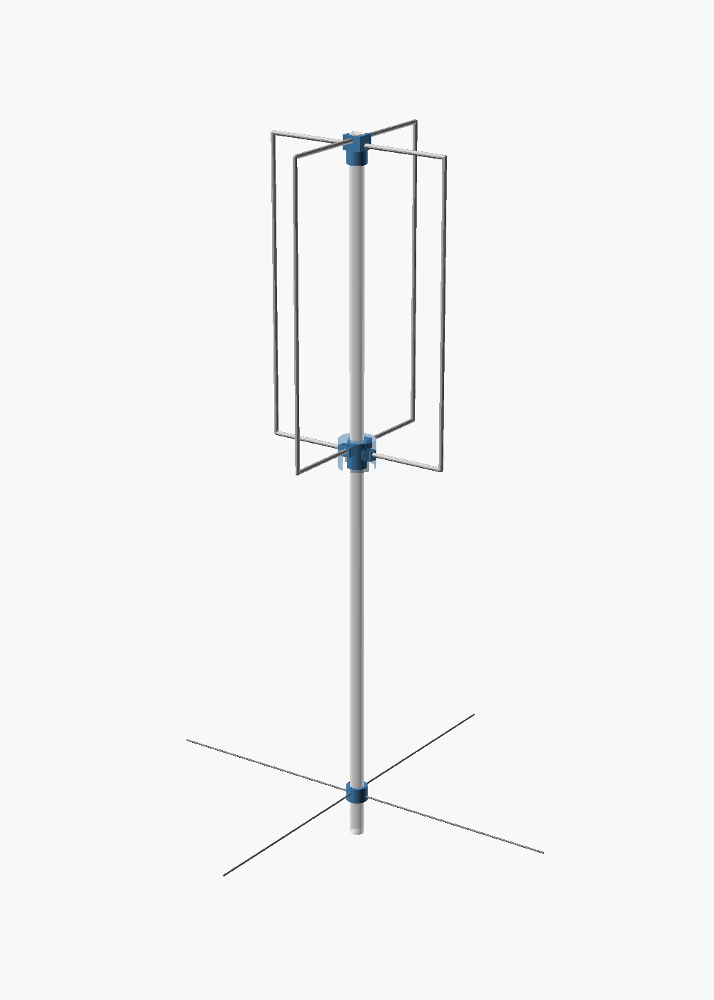
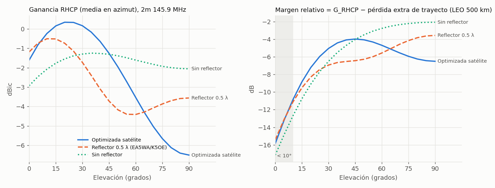
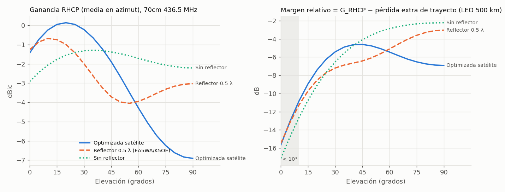
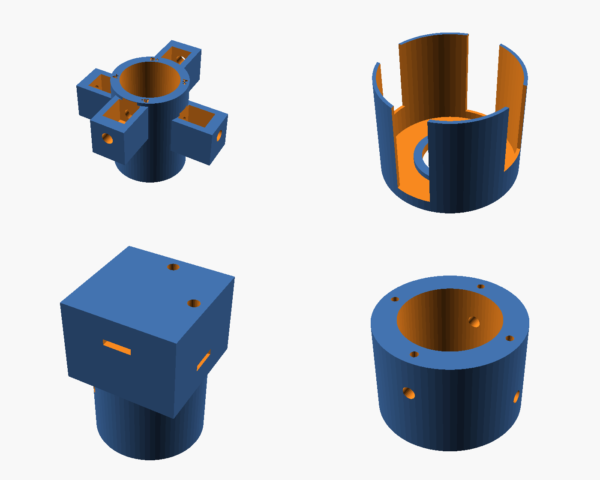

# Antena Eggbeater para satélites (2 m y 70 cm) con piezas impresas en 3D

Es una adaptación a **satélites LEO** de la [Antena Eggbeater V2 de EA5WA](https://www.ea5wa.com/antenas/antena-eggbeater-v2) (145 MHz), que a su vez se basa en la *Eggbeater II* de **K5OE** y en el trabajo de **EA4CYQ**.

- **Sub-bandas de satélite:** la antena se ha reajustado para 145.8–146.0 MHz y 435–438 MHz.
- **Reflector:** su altura se ha optimizado con NEC2 para enlaces con satélites.
- **Piezas plásticas:** todas son impresas en 3D y paramétricas (OpenSCAD).

| | 2 m (145.9 MHz) | 70 cm (436.5 MHz) |
|---|---|---|
| Lazos (ancho × alto) | **433 × 669 mm** | **148 × 228 mm** |
| Conductor | Pletina de Al 10×2 mm (U) + 2 varillas roscadas M6 | Varilla de Al o latón de 4 mm |
| Desnivel entre lazos | 12 mm | 8 mm |
| Reflector (2 varillas cruzadas Ø4) | **986 mm**, a **822 mm** bajo los lazos | **330 mm**, a **275 mm** bajo los lazos |
| Línea de fase RG-62 (93 Ω) | **363 mm** de cable + 20 mm de colas | **116 mm** de cable + 10 mm de colas |
| ROE simulada en la sub-banda | 1.02 / 1.02 / 1.01 | 1.01 / 1.03 / 1.04 |
| Mástil (PVC) | Ø32 mm, unos 2 m | Ø25 mm, unos 1 m |
| Polarización | RHCP (LHCP invirtiendo B+ y B−) | RHCP |



## Por qué se ha reajustado para satélites
Un satélite a 500 km está a ~1700 km cuando se ve a 10° de elevación, y a 500 km cuando pasa por el cenit. A 10° eso supone **10.6 dB más de pérdida de trayecto**.
Para un satélite, la antena ideal tiene más ganancia hacia el horizonte que hacia arriba. Con `sim/optimize.py` se buscó, en NEC2, la altura del reflector que **maximiza el peor margen de enlace entre 10° y 90°**:




Ganancia RHCP media en azimut, en dBic (2 m):

| Elevación | 0° | 10° | 20° | 30° | 45° | 60° | 90° |
|---|---|---|---|---|---|---|---|
| **Optimizada (reflector 0.4 λ)** | −1.6 | −0.2 | **+0.3** | **+0.2** | −1.3 | −3.5 | −6.5 |
| Reflector 0.5 λ (EA5WA/K5OE) | −1.2 | −0.5 | −0.7 | −1.7 | −3.7 | −4.4 | −3.6 |
| Sin reflector | −2.9 | −2.1 | −1.6 | −1.3 | −1.3 | −1.6 | −2.1 |

La versión optimizada concentra la ganancia entre 10° y 40° de elevación, que es donde un satélite LEO pasa la mayor parte del tiempo. En el cenit tiene menos ganancia, pero ahí el satélite está 3–4 veces más cerca.
**Validación del modelo:** el mismo modelo, con las medidas originales de EA5WA a 145 MHz, da una ROE de **1.09**. EA5WA midió **1.1**.

## Piezas impresas (`stl/`)

| Pieza | Función | Cant. |
|---|---|---|
| `buje_<banda>` | Cubo de alimentación: sujeta los lados inferiores de los lazos a dos alturas. Tiene los 4 bornes rotulados A+, A−, B+ y B−, y la salida del coaxial al interior del tubo | 1 |
| `tapa_<banda>` | Tapa del buje: protege los bornes y la línea de fase de la lluvia. Baja por el tubo y está abierta por abajo para drenar | 1 |
| `tope_<banda>` | Remate del tubo: cruza los lados superiores de los lazos a dos alturas, sin que se toquen | 1 |
| `reflector_<banda>` | Collarín del reflector. También sirve de **guía para taladrar** el tubo | 1 |



Cómo imprimirlas:
- **Material:** **ASA** (el mejor a la intemperie) o **PETG**. No uses PLA en exterior.
- **Parámetros:** 0.2 mm de capa, 4 perímetros, 40 % de relleno.
- **Soportes:** no hacen falta. La tapa ya sale boca abajo.

## Material (una antena)

| | 2 m | 70 cm |
|---|---|---|
| Lazos | 2 pletinas de Al 10×2 de 1821 mm + 4 varillas roscadas M6 de 215 mm (inox. o latón) con 16 tuercas | 2 varillas de Al o latón Ø4 de 723 mm |
| Reflector | 2 varillas de Al Ø4 de 986 mm | 2 varillas de Al Ø4 de 330 mm |
| Línea de fase | RG-62 de 93 Ω, 403 mm en total (363 + 2×20) | RG-62, 136 mm en total (116 + 2×10) |
| Mástil | Tubo de PVC Ø32, 2 m | Tubo de PVC Ø25, 1 m |
| Tornillería | 2 × M4×20 + tuerca (tope), 2 × autorroscante 4.2×16 (buje y reflector al tubo), 4 × autorroscante M3×10 (prisioneros del reflector), 4 terminales de ojal M6 | 6 × M3×12 + tuerca (bornes y tope), 2 × autorroscante 4.2×13, 4 × autorroscante M3×8, 4 terminales de ojal M3 |
| Otros | Coaxial de 50 Ω de baja pérdida, choque de RF, cinta autovulcanizante | Igual |

Guía paso a paso: [docs/CONSTRUCCION.md](docs/CONSTRUCCION.md). Teoría y fuentes: [docs/TEORIA.md](docs/TEORIA.md). Pruebas: [docs/PRUEBAS.md](docs/PRUEBAS.md).

## Estructura del repositorio
```
cad/eggbeater_piezas.scad   Piezas paramétricas (BAND = "2m" | "70cm", PART = buje|tapa|tope|reflector|montaje)
cad/gen/                    Medidas eléctricas generadas desde la simulación
stl/                        STL listos para imprimir
sim/                        Modelo NEC2 (nec2c), optimización, gráficas y resultados.json
scripts/                    Build (STL + renders) y generación de includes
docs/                       Construcción, teoría, pruebas e imágenes
```

## Regenerar
Necesitas `openscad`, `xvfb`, `python3` con matplotlib y Pillow, y para simular, `nec2c`.
```bash
make        # STL + imágenes + gráficas a partir de sim/resultados.json
make sim    # simulación NEC2 + ajuste para satélites (~2 min) y después build
```
Si cambias el tubo, el conductor o los tornillos, los parámetros están al principio de `cad/eggbeater_piezas.scad`.

## Créditos
- Diseño base: **EA5WA**, [Antena Eggbeater V2](https://www.ea5wa.com/antenas/antena-eggbeater-v2).
- Eggbeater II: **K5OE**, Jerry Brown.
- Teoría: **ON6WG/F5VIF**, [Eggbeater VHF/UHF](https://qsl.net/k/kd7tww/Antennas/Antenne%20Eggbeater-Engl-Part1-Full.pdf).
