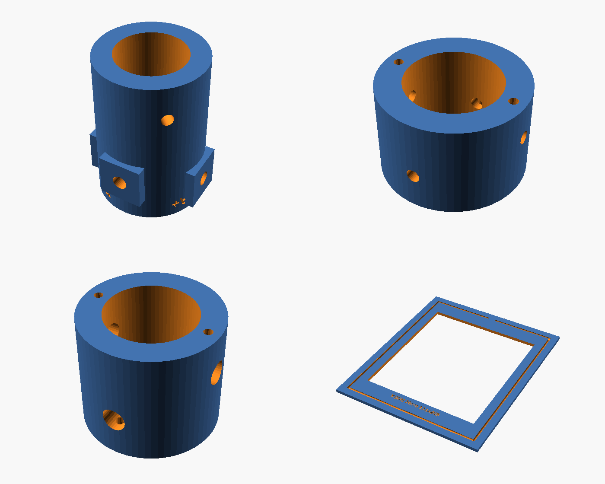

# Eggbeater II de K5OE (2 m y 70 cm) con piezas impresas en 3D

Es la **Eggbeater II de Jerry Brown, K5OE**, la antena omnidireccional con polarización circular que diseñó para satélites LEO. Se reproduce **con sus medidas originales**. Lo único añadido son las piezas de plástico impresas en 3D que sustituyen a los accesorios de PVC y a los taladros hechos a ojo. No se ha cambiado ninguna medida eléctrica.

| | 2 m | 70 cm |
|---|---|---|
| Lazos (ancho × alto, entre ejes) | **51 × 63 cm** | **17.1 × 20.9 cm** |
| Conductor | Hilo de cobre #8 AWG (3.26 mm) | Igual, o varilla de 3 mm |
| Reflectores (2 varillas de Al de 1/4" cruzadas) | **100.5 cm**, a **101 cm** bajo los lazos | **33.5 cm**, a **33 cm** bajo los lazos |
| Línea de fase RG-62 (93 Ω) | **41.5 cm** con malla (se corta a 46.5 cm y se pelan 2.5 cm por extremo) | **13.5 cm** (se corta a 18.5 cm y se pelan 2.5 cm por extremo) |
| Alimentación | Tapón en la punta del mástil; los lados inferiores atraviesan el tubo | Igual |
| Polarización | RHCP (LHCP cruzando la línea de fase en B) | RHCP |


## Verificación por simulación (NEC2)
Se modeló la geometría de K5OE **tal cual** en `sim/k5oe.py`, con nec2c. No se optimizó nada.

| | Z entrada | ROE en la sub-banda de satélite | ROE < 1.5 | RHCP a 10° / 30° / 60° / 90° de elevación |
|---|---|---|---|---|
| 2 m (145.9 MHz) | 46.3 − j1.3 Ω | **1.08** | 136–151 MHz | +0.3 / −0.7 / −3.1 / −2.5 dBic |
| 70 cm (436.5 MHz) | 51.2 − j0.5 Ω | **1.00–1.05** | 419–463 MHz | +0.1 / −0.8 / −3.2 / −2.8 dBic |


Con el reflector a ~½ λ, K5OE concentra la ganancia en los ángulos bajos (0–30°). Ahí es donde el satélite está más lejos y donde pasa más tiempo, y es la razón de ser de su diseño.

## Piezas impresas (`stl/`)

| Pieza | Función |
|---|---|
| `tapon_<banda>` | Tapón de alimentación en la punta del tubo. Lleva los 4 bornes rotulados A+, A−, B+ y B− (tornillos de latón M6 en 2 m, M5 en 70 cm), con el lazo B 6 mm más bajo que el A. Dentro tiene una cámara para tuercas, terminales y línea de fase, y el coaxial sube por dentro del tubo. Se imprime boca abajo |
| `guia_lazos_<banda>` | Collarín a la altura de los lados inferiores. Sirve de **guía para taladrar** el tubo en cruz y a dos alturas, y luego sujeta los hilos con prisioneros |
| `guia_reflector_<banda>` | Lo mismo para las dos varillas del reflector (1/4") |
| `plantilla_70cm` | Plantilla de 171 × 209 mm para doblar y comprobar el lazo de 70 cm (el de 2 m no cabe en una impresora) |



Cómo imprimirlas:
- **Material:** **ASA** o **PETG** (nada de PLA en exterior).
- **Parámetros:** 0.2 mm de capa, 4 perímetros, 40 % de relleno.
- **Soportes:** no hacen falta.

## Material (una antena)

| | 2 m | 70 cm |
|---|---|---|
| Lazos | 2 × 2.25 m de hilo de Cu #8 AWG (se usan 2234 mm) | 2 × 0.75 m de hilo #8 o de varilla de 3 mm (se usan 718 mm) |
| Reflector | 2 varillas de Al Ø1/4" de 1005 mm | 2 de 335 mm |
| Línea de fase | 46.5 cm de RG-62 | 18.5 cm de RG-62 |
| Mástil | Tubo de PVC Ø32 de 2 m | Tubo de PVC Ø25 de 0.8 m |
| Bornes | 4 tornillos M6×16 de latón, 8 tuercas, 8 arandelas, 4 terminales de ojal | 4 tornillos M5×12 de latón, etc. |
| Otros | 3 autorroscantes de 4.2 mm, 8 autorroscantes M3, coaxial de 50 Ω, choque de RF, cinta autovulcanizante | Igual |

Guías: [construcción](docs/CONSTRUCCION.md), [K5OE y fuentes](docs/TEORIA.md) y [pruebas](docs/PRUEBAS.md).

## Estructura
```
cad/eggbeater_k5oe.scad   Piezas paramétricas (BAND = "2m" | "70cm"; PART = tapon | guia_lazos | guia_reflector | plantilla | montaje)
stl/                      STL listos para imprimir
sim/                      Modelo NEC2 de la geometría K5OE (eggbeater.py, k5oe.py), resultados y mazos .nec
scripts/build.sh          Regenera STL, renders y gráficas
docs/                     Construcción, teoría, pruebas e imágenes
```
`make` regenera las piezas y las gráficas. `make sim` repite la simulación NEC2 (necesita `nec2c`).

## Créditos
Diseño eléctrico: **Jerry Brown, K5OE**, *Eggbeater II Omni LEO Antenna*. Las piezas impresas y la verificación NEC2 son de este repositorio.
